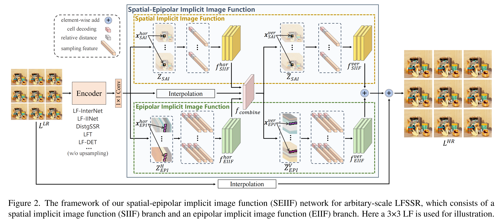
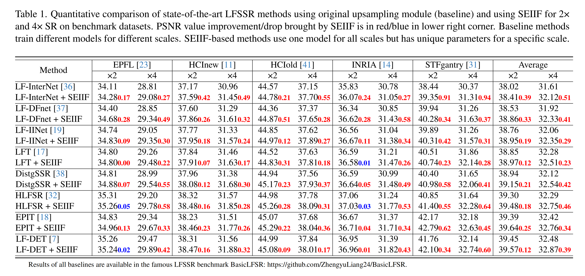
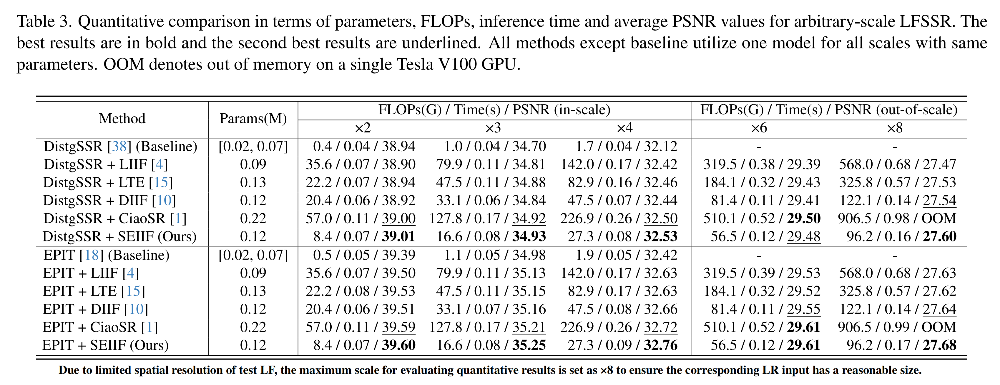

# SEIIF

This is the official pytorch implementation repository of [Rethinking the Upsampling Process in Light Field Super-Resolution with Spatial-Epipolar Implicit Image Function.](https://openaccess.thecvf.com//content/ICCV2025/papers/Cong_Rethinking_the_Upsampling_Process_in_Light_Field_Super-Resolution_with_Spatial-Epipolar_ICCV_2025_paper.pdf) (ICCV 2025)


## Introduction

We propose a general decoder network called **spatial-epipolar implicit image function (SEIIF)**, which **optimizes upsampling process** to significantly improve performance and **supports arbitrary-scale light field image super-resolution**. Specifically, SEIIF contains two complementary upsampling patterns. One is **spatial implicit image function** (SIIF) that exploits intra-view information in sub-aperture images. The other is **epipolar implicit image function** (EIIF) that mines inter-view information in epipolar plane images. By unifying the upsampling step of two branches, SEIIF extra introduces cross-branch feature interaction to fully fuse intra-view information and inter-view information.




## Datasets

Following [BasicLFSR](https://github.com/ZhengyuLiang24/BasicLFSR), we use five datasets, including EPFL, HCInew, HCIold, INRIA and STFgantry for training and testing. Please download the datasets in the official repository of [BasicLFSR](https://github.com/ZhengyuLiang24/BasicLFSR).


## Results

- #### Fixed-scale LFSSR



- #### Arbitrary-scale LFSSR




## Code

### Dependencies

- pytorch 1.8.0 + torchvision 0.9.0 + cuda 12.2 + python 3.8.19
- matlab 

### Training and Test Data

- #### Training Data

1. Please refer to [BasicLFSR](https://github.com/ZhengyuLiang24/BasicLFSR) for detailed introduction (completely the same without any modification).   

   Run `Generate_Data_for_Training.m` to generate training data by **setting factor as 2,3 and 4, respectively**. The generated data should be saved in `./datasets/train/(SR_5x5_2x / SR_5x5_3x / SR_5x5_4x)`.

   ```
   ├── datasets                                
   │   ├── train                                     
   │   │   ├── SR_5x5_2x
   │   │   │   ├── EPFL
   │   │   │   ├── HCI_new
   │   │   │   ├── HCI_old
   |   |   |   ├── INRIA_Lytro
   │   │   |   ├── Stanford_Gantry
   │   │   ├── SR_5x5_3x
   │   │   │   ├── EPFL
   │   │   │   ├── HCI_new
   │   │   │   ├── HCI_old
   |   |   |   ├── INRIA_Lytro
   │   │   |   ├── Stanford_Gantry
   │   │   ├── SR_5x5_4x
   │   │   │   ├── EPFL
   │   │   │   ├── HCI_new
   │   │   │   ├── HCI_old
   |   |   |   ├── INRIA_Lytro
   │   │   |   ├── Stanford_Gantry
   ```

2. For the first training stage by setting $α∼U(1,4,0.5)$. 
   - When $α=1.5$ or $2$, the training sample is selected from `SR_5x5_2x`.
   - When $α=2.5$ or $3$, the training sample is selected from `SR_5x5_3x`.
   - When $α=3.5$ or $4$, the training sample is selected from `SR_5x5_4x`.

​		The relevant code about selecting training sample is in `train.py`.

- #### Test Data

1. Please refer to [BasicLFSR](https://github.com/ZhengyuLiang24/BasicLFSR) for detailed introduction (completely the same without any modification).  

   Run `Generate_Data_for_Test.m` to generate test data by **setting factor as 2,3,4,6,8 respectively**. The generated data should be saved in `./datasets/test/(SR_5x5_2x / SR_5x5_3x / SR_5x5_4x / SR_5x5_6x / SR_5x5_8x)`.

   ```
   ├── datasets                                
   │   ├── test                                     
   │   │   ├── SR_5x5_2x
   │   │   │   ├── EPFL
   │   │   │   ├── HCI_new
   │   │   │   ├── HCI_old
   |   |   |   ├── INRIA_Lytro
   │   │   |   ├── Stanford_Gantry
   │   │   ├── SR_5x5_3x
   │   │   │   ├── EPFL
   │   │   │   ├── HCI_new
   │   │   │   ├── HCI_old
   |   |   |   ├── INRIA_Lytro
   │   │   |   ├── Stanford_Gantry
   │   │   ├── SR_5x5_4x
   │   │   │   ├── EPFL
   │   │   │   ├── HCI_new
   │   │   │   ├── HCI_old
   |   |   |   ├── INRIA_Lytro
   │   │   |   ├── Stanford_Gantry
   ......
   ```

2. For test stage by setting $α=2,3,4,6,8$.

   - When $α=2$ (×2 LFSSR task), all test sample is selected from `SR_5x5_2x`.
   - When $α=3$ (×3 LFSSR task), all test sample is selected from `SR_5x5_3x`.
   - When $α=4$ (×4 LFSSR task), all test sample is selected from `SR_5x5_4x`.
   - When $α=6$ (×6 LFSSR task), all test sample is selected from `SR_5x5_6x`.
   - When $α=8$ (×8 LFSSR task), all test sample is selected from `SR_5x5_8x`.

### Train

- #### Model

  We have already combined the proposed SEIIF with eight existing LFSSR encoders. 

  - [LF-InterNet ](https://github.com/YingqianWang/LF-InterNet)		—     `model_InterNet.py` 
  - [LF-DFnet ](https://github.com/YingqianWang/LF-DFnet)            —     `model_DFnet.py`
  - [LF-IINet](https://github.com/GaoshengLiu/LF-IINet)               —     `model_IINet.py` 
  - [LFT ](https://github.com/ZhengyuLiang24/LFT)                      —     `model_LFT.py` 
  - [DistgSSR](https://github.com/YingqianWang/DistgSSR)             —     `model_Distg.py` 
  - [HLFSR](https://github.com/duongvinh/HLFSR-SSR)                  —     `model_HLFSR.py` 
  - [EPIT](https://github.com/ZhengyuLiang24/EPIT)                     —     `model_EPIT.py` 
  - [LF-DET](https://github.com/Congrx/LF-DET)                 —     `model_LF_DET.py` 

- #### Run

  1. LFSSR encoder selection

     ```python
     # train.py
     from model_InterNet import Net		# here model_xxx can be model_Internet, model_DFnet, model_IINet, model_LFT, model_Distg, model_HLFSR, model_EPIT, model_LF_DET
     ```
     
  2. Training strategy configuration
  
     - first stage: continuous-scale training
  
     ```python
     # train.py
     def parse_args():
         parser = argparse.ArgumentParser()
         
         # continuous-scale training
         parser.add_argument('--train_stage', type=int, default=1, help='1 means continuous-scale training and 2 means fine-tuning fixed-scale training')
         parser.add_argument("--finetune_factor", type=int, default=2, help="upscale factor for fine-tuning")
         parser.add_argument('--lr', type=float, default=2e-4, help='initial learning rate')
         parser.add_argument('--n_epochs', type=int, default=101, help='number of epochs to train')
         parser.add_argument('--n_steps', type=int, default=20, help='number of epochs to update learning rate')
         parser.add_argument('--gamma', type=float, default=0.5, help='learning rate decaying factor')
         parser.add_argument('--load_pretrain', type=bool, default=False)
         parser.add_argument('--model_path', type=str, default='./log/')
         
         return parser.parse_args()
     ```
  
     - second stage: fine-tuning fixed-scale training
  
       Note set `finetune_factor` as the target upscale factor for fixed-scale LFSSR task (The following setting takes `2` as target upscale factor).  
  
     ```python
     # train.py
     def parse_args():
         parser = argparse.ArgumentParser()
         
         # fine-tuning fixed-scale training
         parser.add_argument('--train_stage', type=int, default=2, help='1 means continuous-scale training and 2 means fine-tuning fixed-scale training')
         parser.add_argument("--finetune_factor", type=int, default=2, help="upscale factor for fine-tuning")
         parser.add_argument('--lr', type=float, default=2.5e-4, help='initial learning rate')
         parser.add_argument('--n_epochs', type=int, default=111, help='number of epochs to train')
         parser.add_argument('--n_steps', type=int, default=5, help='number of epochs to update learning rate')
         parser.add_argument('--gamma', type=float, default=0.5, help='learning rate decaying factor')
         parser.add_argument('--load_pretrain', type=bool, default=True)
         parser.add_argument('--model_path', type=str, default='./log/InterNet_ArbitrarySR_5x5_epoch_18.pth.tar')
         
         return parser.parse_args()
     ```
  
  3. Other configuration
  
     ```python
     # train.py
     def parse_args():
         parser = argparse.ArgumentParser()
         
         parser.add_argument('--device', type=str, default='cuda:0')
         parser.add_argument("--angRes", type=int, default=5, help="angular resolution")
         parser.add_argument('--model_name', type=str, default='InterNet')
         parser.add_argument('--trainset_dir_2', type=str, default='../datasets/train/SR_5x5_2x/')
         parser.add_argument('--trainset_dir_3', type=str, default='../datasets/train/SR_5x5_3x/')
         parser.add_argument('--trainset_dir_4', type=str, default='../datasets/train/SR_5x5_4x/')
         parser.add_argument('--testset_dir', type=str, default='../datasets/test/SR_5x5_2x/')
         parser.add_argument('--batch_size', type=int, default=8)
         parser.add_argument("--patchsize", type=int, default=64, help="crop into patches for validation")
         parser.add_argument("--stride", type=int, default=32, help="stride for patch cropping")
         
         return parser.parse_args()
     ```
  
  4. Start training
  
     ```shell
     python train.py
     ```

### Test

- #### Pretrained model

  The folder `pretrain` provides pre-trained models related to SEIIF in conjunction with eight LFSSR encoders.

  - `xxx_ArbitrarySR_5x5.pth.tar`			Pretrained model_xxx for arbitrary-scale LFSSR
  - `xxx_2xSR_5x5.pth.tar`                           Pretrained model_xxx for fixed-scale 2×LFSSR
  - `xxx_4xSR_5x5.pth.tar`                           Pretrained model_xxx for fixed-scale 4×LFSSR

- #### Run

  1. LFSSR encoder selection

     ```python
     # test.py
     from model_InterNet import Net		# here model_xxx can be model_Internet, model_DFnet, model_IINet, model_LFT, model_Distg, model_HLFSR, model_EPIT, model_LF_DET
     ```
     
2. test configuration
  
   ```python
     # test.py
     def parse_args():
         parser = argparse.ArgumentParser()
         parser.add_argument('--device', type=str, default='cuda:0')
         parser.add_argument("--angRes", type=int, default=5, help="angular resolution")
         
         # test 4x LFSSR   
         parser.add_argument("--upscale_factor", type=int, default=4, help="upscale factor")
         parser.add_argument('--testset_dir', type=str, default='../datasets/test/SR_5x5_4x/')
         # test 3x LFSSR   
         parser.add_argument("--upscale_factor", type=int, default=3, help="upscale factor")
         parser.add_argument('--testset_dir', type=str, default='../datasets/test/SR_5x5_3x/')
         # test 2x LFSSR   
         parser.add_argument("--upscale_factor", type=int, default=2, help="upscale factor")
         parser.add_argument('--testset_dir', type=str, default='../datasets/test/SR_5x5_2x/')
     	
         # Encoder LF-DET / LFT   patchsize=32   stride=16
         parser.add_argument("--patchsize", type=int, default=32, help="LFs are cropped into patches to save GPU memory")
         parser.add_argument("--stride", type=int, default=16, help="The stride between two test patches is set to patchsize/2")
         # Other encoders         patchsize=64   stride=32
         parser.add_argument("--patchsize", type=int, default=64, help="LFs are cropped into patches to save GPU memory")
         parser.add_argument("--stride", type=int, default=32, help="The stride between two test patches is set to patchsize/2")
     
         parser.add_argument('--model_path', type=str, default='log/LFT_2xSR_5x5_epoch_84.pth.tar')
         parser.add_argument('--save_path', type=str, default='Results/')
         
         return parser.parse_args()
     ```
  
3. Start testing
  
   ```shell
     python test.py
     ```
  
   


## Acknowledgement

Our work and implementations are inspired and based on the following projects:

- [BasicLFSR](https://github.com/ZhengyuLiang24/BasicLFSR)
- [LIIF](https://github.com/yinboc/liif)

We sincerely thank the authors for sharing their code and amazing research work!

## Citation

If you find this work helpful, please consider citing the following papers:

```
@inproceedings{cong2025seiif,
  title={Rethinking the Upsampling Process in Light Field Super-Resolution with Spatial-Epipolar Implicit Image Function},
  author={Cong, Ruixuan and Wang, Yu and Zhao, Mingyuan and Yang, Da and Chen, Rongshan and Sheng, Hao},
  booktitle={Proceedings of the IEEE/CVF International Conference on Computer Vision},
  year={2025}
}
```

## Contact

If you have any questions regarding this work, please send an email to [congrx@buaa.edu.cn](mailto:congrx@buaa.edu.cn) . 
